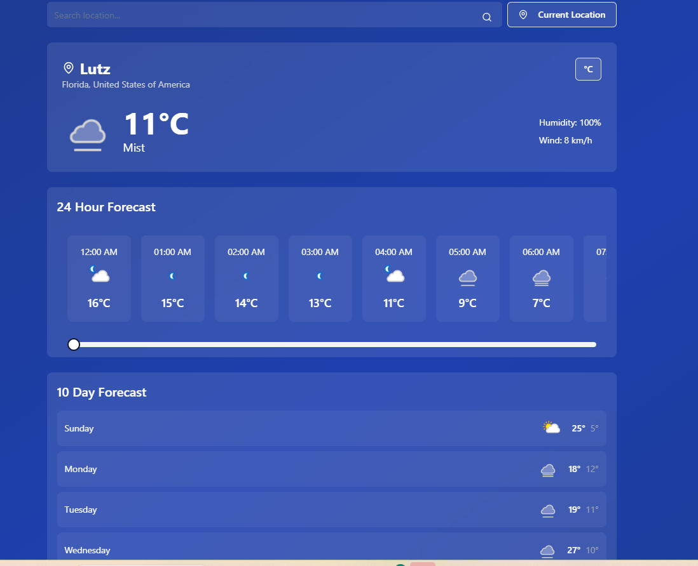

# Weather Tracker Application

A modern, responsive weather tracking application built with React and TypeScript that provides real-time weather information and forecasts.

## Features

- **Current Weather Display**: View current weather conditions including temperature, humidity, and wind speed
- **Location Search**: Search for weather information by city name or use your current location
- **Temperature Unit Toggle**: Switch between Celsius and Fahrenheit
- **24-Hour Forecast**: Detailed hourly weather forecast with scrollable interface
- **10-Day Forecast**: Extended weather forecast showing daily high and low temperatures
- **Responsive Design**: Works seamlessly on desktop and mobile devices



## Technologies Used

This project is built with modern web technologies:

- **React**: Frontend library for building user interfaces
- **TypeScript**: Static typing for enhanced development experience
- **Vite**: Next-generation frontend tooling
- **Tailwind CSS**: Utility-first CSS framework
- **Shadcn/ui**: High-quality UI components
- **WeatherAPI**: Real-time weather data provider
- **Supabase**: Backend infrastructure and API key management

## Getting Started

1. Clone the repository:
```bash
git clone <repository-url>
```

2. Install dependencies:
```bash
npm install
```

3. Start the development server:
```bash
npm run dev
```

## Key Components

- **CurrentWeather**: Displays current weather conditions
- **HourlyForecast**: Shows 24-hour weather forecast with scrollable interface
- **DailyForecast**: Presents 10-day weather forecast
- **LocationSearch**: Handles location input and current location detection

## Environment Variables

The application requires the following environment variables:

- `RAPIDAPI_KEY`: API key for WeatherAPI (managed through Supabase)

## License

This project is licensed under the MIT License - see the [LICENSE](LICENSE) file for details.

## Acknowledgments

- Weather data provided by [WeatherAPI.com](https://www.weatherapi.com/)
- UI components from [shadcn/ui](https://ui.shadcn.com/)
- Icons from [Lucide](https://lucide.dev/)
